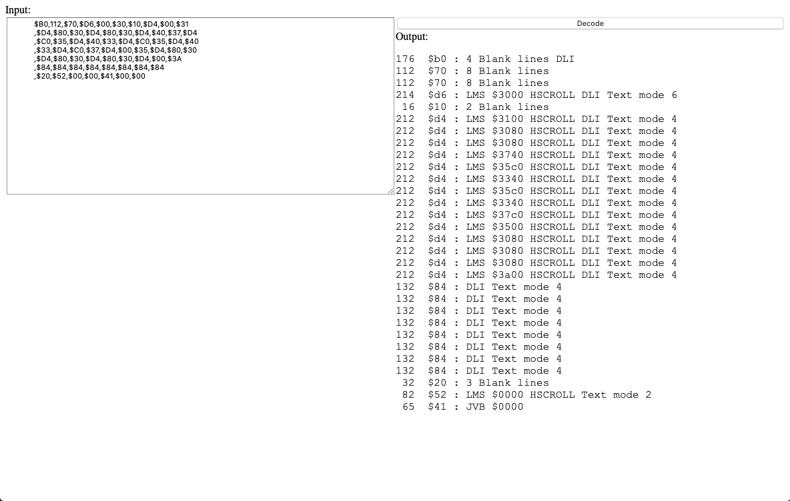

# Atari 8 Bit Display List Decoder

These applications will take an Atari 8 bit display list [https://en.wikipedia.org/wiki/ANTIC](https://en.wikipedia.org/wiki/ANTIC) and decode it into what it actually does.

While reading through old source code, trying to learn how it works, it was frustrating to come across the
display list and try to figure out how the screen is laid out.

There are two versions, one that is written in .Net Core 3.1, which will build and run on any platform with .Net Core installed (MacOS, Windows, Linux). The display list data is currently hard-coded in the actual program.

The second is a web page, that can be opened in any browser. Open the index.html file and there is an input box for the display list codes. The codes can be decimal or hex and have to be comma separated.

Screenshot of the HTML version:

